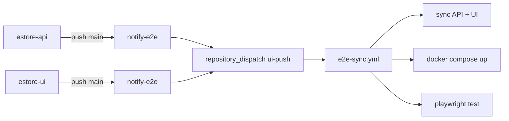

# TechStore E2E

Dépôt d'intégration et de tests E2E pour le projet TechStore.

## Architecture



- **estore-api** : Spring Boot (Java 21, port 9090)
- **estore-ui** : React + Vite + TypeScript
- **estore-e2e** : Playwright + Docker Compose

## Pipeline

Un push sur `main` de **estore-api** ou **estore-ui** déclenche :

1. `notify-e2e.yml` → envoie un `repository_dispatch` à ce repo
2. `e2e-sync.yml` → checkout les dernières versions, commit & push
3. Build et démarre l'API (MySQL + MongoDB + Spring Boot) via Docker Compose
4. Démarre le frontend avec proxy Vite
5. Exécute les tests Playwright
6. Nettoie les services

## Prérequis

- Docker & Docker Compose
- Node.js 20+
- Java 21 (pour build local)

## Tests locaux

```bash
# 1. Démarrer l'infra
docker compose up -d mysql mongodb estore-api

# 2. Attendre que l'API soit prête
curl http://localhost:9090/api/products

# 3. Lancer les tests
npm test
```

## Accéder au site en local

```bash
# Terminal 1 : API
docker compose up -d mysql mongodb estore-api

# Terminal 2 : Frontend
cd estore-ui && npm ci && npx vite --config ../vite.e2e.config.ts
```

Ouvrir `http://localhost:5173`.

## Structure

```
.
├── .github/workflows/e2e-sync.yml   # Pipeline CI principal
├── docker-compose.yml                # MySQL + MongoDB + API
├── playwright.config.ts              # Configuration Playwright
├── vite.e2e.config.ts                # Vite config avec proxy API
├── tests/
│   └── integration.spec.ts           # Tests E2E
├── estore-api/                       # Synced depuis abdelaziz-ebourki/estore-api
└── estore-ui/                        # Synced depuis abdelaziz-ebourki/estore-ui
```
